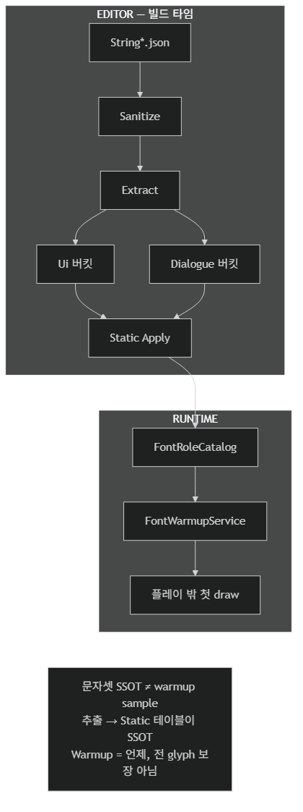
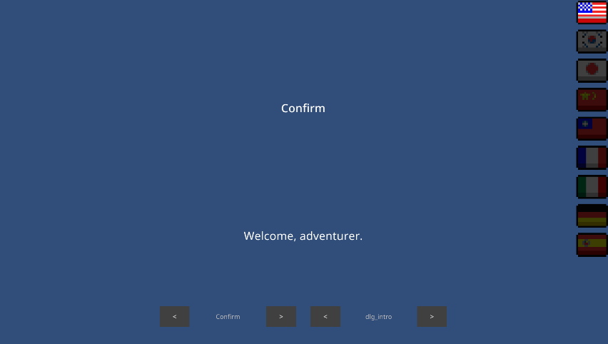
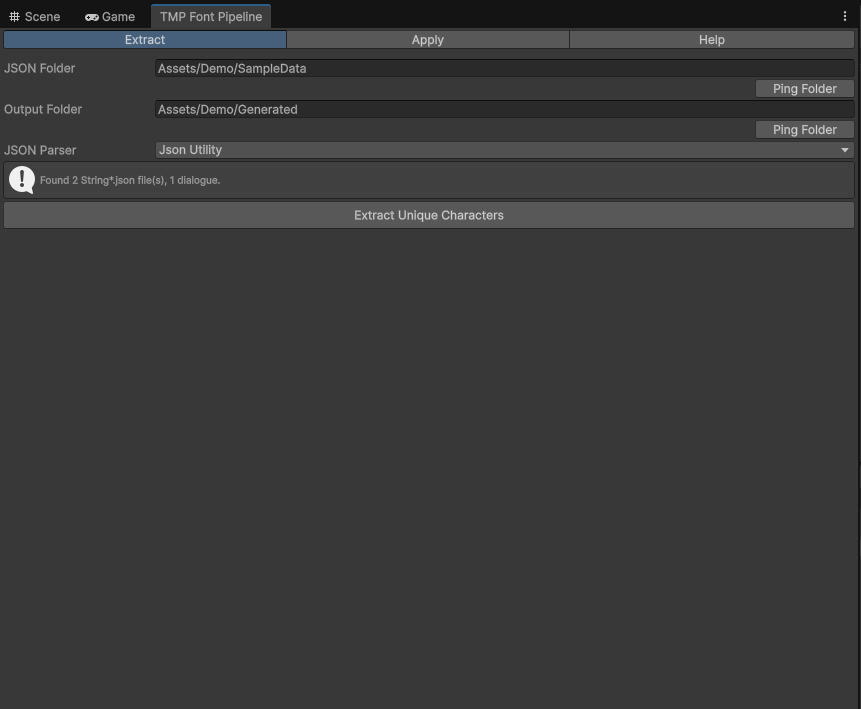
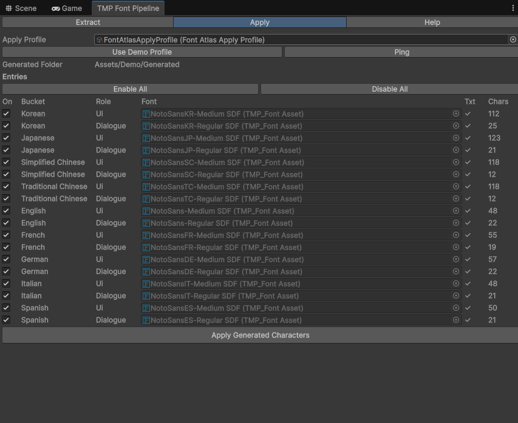
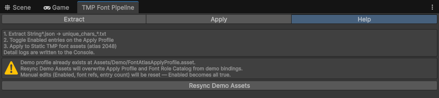
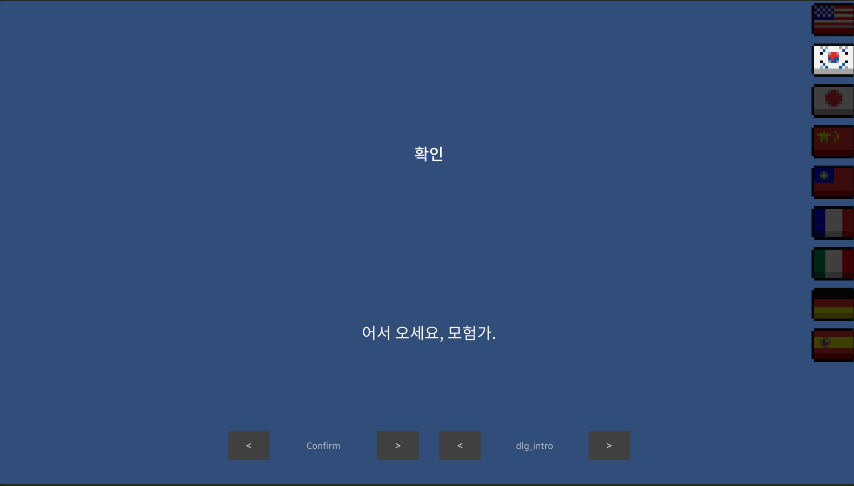
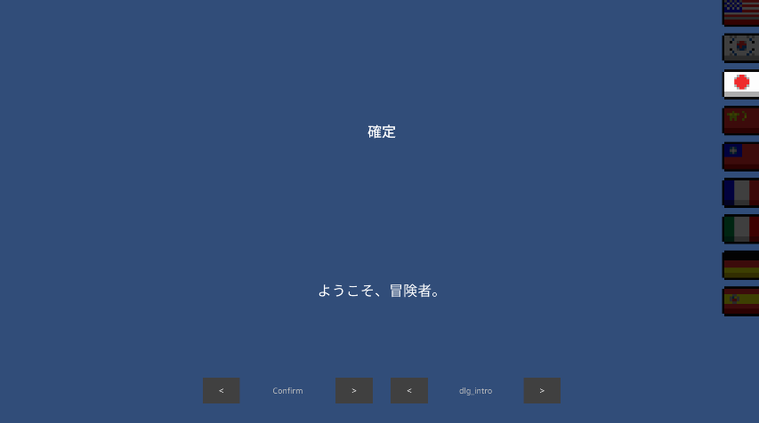

# TMP Font Pipeline

[English](README.md) | **한국어**

로컬라이즈 JSON에서 고유 글자를 추출하고, 런타임 TMP 폰트 워밍업으로 Dynamic atlas 성장·첫 draw 스파이크를 플레이 밖으로 옮기는 파이프라인이에요.

**포함**

- **문자 추출** — `String*.json` → `unique_chars_*.txt` (언어 버킷, Ui/Dialogue 분리, sanitize)
- **Static atlas Apply** — Generated txt → Editor Window + `FontAtlasApplyProfile`로 TMP Static SDF bake
- **런타임 warmup** — `FontWarmupService` + `IFontWarmupTarget` (역할별 sample, font 1개당 1프레임)
- **Demo** (선택) — `Assets/Demo` 놀이터: `SampleScene`, 언어 전환, string key picker

게임에 넣을 패키지는 **`Assets/TmpFontPipeline`**만 복사해요. `Assets/Demo`는 참고용이에요.



정본: [`docs/diagrams/pipeline.ko.mmd`](docs/diagrams/pipeline.ko.mmd)



## 설치

`unity-tmp-font/Assets/TmpFontPipeline`를 프로젝트 `Assets/`로 통째 복사해요 (Runtime/Editor asmdef 유지).

이 저장소 Unity 프로젝트에는 이미 `Assets/TmpFontPipeline`와 데모 놀이터 `Assets/Demo`가 있어요. **Demo는 설치 대상이 아니에요.**

Unity에서 프로젝트를 연 뒤 **TMP Essentials**를 한 번 import하세요 (Window → TextMeshPro → Import TMP Essential Resources). 기본 추출은 Unity `JsonUtility`예요. `com.unity.nuget.newtonsoft-json`은 선택적 Newtonsoft 파서 모드용 Editor 의존성이에요.

## 불변조건

- 문자셋 SSOT = 추출된 Static atlas (`unique_chars_*.txt` → TMP Character Table). 워밍업 sample text가 아니에요.
- Warmup은 **언제** 처음 그리는지를 담당해요. 전 glyph 보장은 하지 않아요.
- Warmup **sample text는 역할별**이에요 — Ui는 UI 버킷 문자열(예: `Confirm`), Dialogue는 dialogue 버킷(예: `dlg_intro`). sample은 대상 Static atlas와 **같은 추출 버킷**에서 고르세요.
- 추출 전 sanitize로 TMP 태그·placeholder·토큰을 제거해요 — JSON 원문을 그대로 아틀라스에 넣지 않아요. **런타임 표시**(Demo `DemoStringTable`)는 JSON 필드를 그대로 읽어요 — 화면용 문장은 JSON에 완성형으로 두세요(런타임 `[token]` 치환 없음).
- UI·Dialogue 버킷을 분리해, 대화 전용 CJK가 UI 폰트 atlas를 불필요하게 키우지 않아요.
- **Font usage role:** `Ui` = 인게임 공용(Demo Medium), `Dialogue` = 대화(Regular). weight enum이 아니라 어떤 Static asset에 어떤 extract 버킷을 넣을지 구분해요.
- 유럽어는 언어별로 완전 분리해요 (`English`, `French`, `German`, `Italian`, `Spanish`) — Ui/Dialogue 모두 각자 `unique_chars_<Language>.txt` / `unique_chars_<Language>_StringDialogue.txt`를 사용해요.
- 간체 중국어 필드명은 **`SimplifiedChinese`** (정식 철자)예요.

Sanitize 제거 대상: TMP style/color/bold/italic/size 태그, `<sprite…>`, `{0}` placeholder, `[token]`, 제어·레이아웃 코드포인트.

`Assets/Demo/Fonts/Dynamic/`은 이 추출의 대상이 **아니에요**. 예측 불가 문자열(리더보드 닉네임 등)에만 Dynamic을 쓰세요.

## 이 패키지가 아닌 것

- 출시용 로컬라이즈·Font Asset 전체 템플릿 (`Assets/Demo`는 놀이터)
- Dynamic atlas를 Static 추출 파이프라인으로 다루는 것
- 런타임 `[token]` 치환·문자열 테이블 시스템 (표시용 문장은 JSON에 완성본으로)

## Editor — 문자 추출



**Tmp Font Pipeline → Open Window** → **Extract** 탭.

1. JSON/출력 폴더·파서(`JsonUtility` 기본, 불규칙 JSON은 `Newtonsoft`) 설정.
2. **Extract Unique Characters**. `String*.json` 수정 후에는 **Extract를 다시** 실행해 `Assets/Demo/Generated/`와 맞추세요.
   - 입력 기본: `Assets/Demo/SampleData` (`String*.json`)
   - 출력 기본: `Assets/Demo/Generated` (`unique_chars_*.txt`)

| 출력 | 소스 |
|------|------|
| `unique_chars_Korean.txt` 등 | UI / non-dialogue `String*.json` |
| `unique_chars_*_StringDialogue.txt` | `StringDialogue*` 파일 |
| `unique_chars_English.txt` | `English` 필드 (`String*.json`) |
| `unique_chars_French.txt` | `French` 필드 (`String*.json`) |
| `unique_chars_German.txt` | `German` 필드 (`String*.json`) |
| `unique_chars_Italian.txt` | `Italian` 필드 (`String*.json`) |
| `unique_chars_Spanish.txt` | `Spanish` 필드 (`String*.json`) |

## Editor — Static atlas Apply



같은 창 → **Apply** 탭 (**Help**에서 Demo 시드).

1. **Font Atlas Apply Profile** 지정(또는 **Use Demo Profile**), 엔트리 **Enabled** 토글(또는 **Enable All** / **Disable All**).
2. **Apply Generated Characters**.
   - **Ping**은 Project 창에서 프로필 에셋을 하이라이트해요.
   - Apply 시 대상 atlas 크기를 `2048x2048`로 맞춘 뒤 bake해요.
3. 대상 Font Asset의 Atlas Population Mode = **Static** 확인.

**Help** 탭 — Demo 시드:



| Demo 프로필 | 버튼 | 동작 |
|-------------|------|------|
| 없음 | **Create Demo Assets** | `Assets/Demo`에 `FontAtlasApplyProfile` + `FontRoleCatalog` 생성·시드, Active Profile 설정 |
| 있음 | **Resync Demo Assets** | 동일 에셋을 로드한 뒤 demo 바인딩으로 **덮어씀** (`Enabled` 전부 true, 수동 편집 초기) |

메뉴 **Tmp Font Pipeline → Font Atlas Apply Profile → Create Demo Assets**와 동일해요. 유럽 분리 이전 프로필이면 다시 실행(재시드)하세요.

Demo 매핑 (Create Demo Assets 후):

| Bucket | Role | Demo Static asset |
|--------|------|-------------------|
| Korean (etc.) | Ui | `*/NotoSans*-Medium SDF` |
| Korean (etc.) | Dialogue | `*/NotoSans*-Regular SDF` |
| English/French/German/Italian/Spanish | Ui | `EN/FR/DE/IT/ES/*-Medium SDF` |
| English/French/German/Italian/Spanish | Dialogue | `EN/FR/DE/IT/ES/*-Regular SDF` |

## Runtime — 폰트 조회

**Font Role Catalog** (`Assets → Create → Tmp Font Pipeline → Font Role Catalog`) — `LanguageId` + `Ui` / `Dialogue` → `TMP_FontAsset`.

Demo catalog는 **Create Demo Assets**로 `Assets/Demo`에 시드돼요.

## Runtime — 폰트 warmup

`IFontWarmupTarget`을 **게임·Demo 코드**에서 구현해요. 부팅·언어 변경 시 `FontWarmupService.RequestWarmup`을 호출하세요.

Ui·Dialogue Static atlas는 **서로 다른 추출 버킷**(`unique_chars_*.txt` vs `unique_chars_*_StringDialogue.txt`)이에요. 숨김 warmup 텍스트가 atlas에 없는 글자를 참조하지 않도록 **역할별** sample을 넘기세요.

| Role | Demo sample 출처 | 예 (KO) |
|------|------------------|---------|
| `Ui` | `StringUI` → `Confirm` | `확인` |
| `Dialogue` | `StringDialogue` → `dlg_intro` | `어서 오세요, 모험가.` |

`FontWarmupSampleText.GetForLanguage(languageId, role)`는 Demo JSON 키와 맞춰져 있어요. 게임 문자열이 다르면 `GetSampleText`를 override하되, 각 sample은 해당 role의 추출 charset 안에 두세요.

```csharp
using TmpFontPipeline;

public sealed class MyFontWarmupTarget : IFontWarmupTarget
{
    public IReadOnlyList<TMP_FontAsset> GetFontsForWarmup(string languageId) { /* ... */ }
    public TMP_FontAsset GetFontForWarmup(string languageId, FontUsageRole role) { /* ... */ }
    public string GetSampleText(string languageId, FontUsageRole role) =>
        FontWarmupSampleText.GetForLanguage(languageId, role);
    public void PreloadSpriteAssets(string languageId) { }
}
```

`FontWarmupService`는 **Ui → Dialogue** 순, font 1개당 1프레임이에요. supersede 시 `onSuperseded`가 호출돼요. warmup 중 input block은 호출 측 책임이에요(Demo 참고).

## Demo (선택)

놀이터 전용이에요. 출시용 로컬라이즈·Font Asset 템플릿이 아니에요.

1. **Tmp Font Pipeline → Open Window → Help → Create Demo Assets** (1회).
2. **Extract** 후 **Apply** — Static SDF가 `Assets/Demo/Generated/`와 일치하는지 확인.
3. **`Assets/Demo/Scenes/SampleScene.unity`** 열고 Play.

| 오브젝트 | 스크립트 | 역할 |
|----------|----------|------|
| `FontWarmup` | `DemoFontWarmupBootstrap` | `IFontWarmupTarget` + `FontWarmupService` 보장 |
| `FontWarmup` | `DemoLanguageSwitcher` | 부팅 `EN` → input block → `RequestWarmup` → 라벨 갱신 → unblock |
| `UiLabel` / `DialogueLabel` | `DemoLocalizedLabel` | role + string key → warmup 후 font·text |

국기 버튼 9개: `EN`, `KO`, `JP`, `SC`, `TC`, `FR`, `DE`, `IT`, `ES`. 라벨은 `Confirm`(Ui / Medium), `dlg_intro`(Dialogue / Regular). 대화 샘플 키: `dlg_intro`(예: KO `어서 오세요, 모험가.`), `dlg_boss`(예: KO `드래곤이 모험가를 부르고 있다!`) — 데이터 토큰 없이 완성 문장만.

**String key picker** (`DemoStringKeyPicker`, `_enableKeyPicker` 켜면 자동 추가): **UI ◀ ▶** / **Dlg ◀ ▶**로 extract된 키만 순환해요. 키 목록은 `DemoStringKeyPicker._uiKeys` / `_dialogueKeys`. 키 변경은 `SetLabelKey` + `RefreshAllLabels`만(warmup 없음).

국기 버튼으로 언어를 바꿔 CJK 예시를 확인할 수 있어요.





데모 폰트 라이선스: [LICENSE-AND-CREDITS.md](Assets/Demo/Fonts/LICENSE-AND-CREDITS.md).

## 관련

- [TMP Static 폰트 아틀라스](https://monet5379.github.io/notes/tmp-static-font-atlas/) — 설계 배경 (Dragon 맥락)
- [TMP 폰트 워밍업](https://monet5379.github.io/notes/tmp-font-warmup/) — warmup vs Static SSOT
- [TMP Font Pipeline (사이트)](https://monet5379.github.io/projects/tmp-font-pipeline/) — 포트폴리오 개요

## 라이선스

[MIT](LICENSE)
